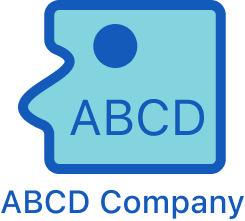

# 

# ABCD-Simulation &middot;  [](https://www.npmjs.com/package/npm) [](http://makeapullrequest.com) [](https://github.com/your/your-project/blob/master/LICENSE)

대전(대신 전해드립니다)는 사용자가 정보를 입력하면 사용자의 말투를 그대로 따라하여 마치 분신처럼 대화해 주는 AI입니다.

## Installing / Getting started

시작하기에 앞서 설치할 것들

```shell
npm install ABCD-Simulation
```

위 라이브러리를 설치하게 되면 시뮬레이터를 사용할 준비가 되었습니다!
코드 에디터 혹은 터미널이 아닌 API는 밑에 설치 방법이 나와 있습니다.

## Developing

### Built With
React, Angular, Vue, NodeJS, Flask

### Prerequisites
먼저 Python 13.5.3 이상 버전의 설치가 필요합니다.


### Setting up Dev

Here's a brief intro about what a developer must do in order to start developing
the project further:

```shell
git clone https://github.com/your/your-project.git
cd your-project/
packagemanager install
```

And state what happens step-by-step. If there is any virtual environment, local server or database feeder needed, explain here.

### Building

If your project needs some additional steps for the developer to build the
project after some code changes, state them here. for example:

```shell
./configure
make
make install
```

Here again you should state what actually happens when the code above gets
executed.

### Deploying / Publishing
give instructions on how to build and release a new version
In case there's some step you have to take that publishes this project to a
server, this is the right time to state it.

```shell
packagemanager deploy your-project -s server.com -u username -p password
```

And again you'd need to tell what the previous code actually does.

## Versioning

We can maybe use [SemVer](http://semver.org/) for versioning. For the versions available, see the [link to tags on this repository](/tags).


## Configuration

Here you should write what are all of the configurations a user can enter when using the project.

## Tests

Describe and show how to run the tests with code examples.
Explain what these tests test and why.

```shell
Give an example
```

## Style guide

Explain your code style and show how to check it.

## Api Reference

If the api is external, link to api documentation. If not describe your api including authentication methods as well as explaining all the endpoints with their required parameters.


## Database

Explaining what database (and version) has been used. Provide download links.
Documents your database design and schemas, relations etc... 

## Licensing

State what the license is and how to find the text version of the license.
